# ✈️ TravelSuggest - Website Gợi Ý Địa Điểm Du Lịch

**TravelSuggest** là một nền tảng hỗ trợ người dùng tìm kiếm, khám phá và lên kế hoạch du lịch dựa trên các tiêu chí cá nhân hóa. Dự án giúp giải quyết vấn đề thông tin du lịch rời rạc bằng cách cung cấp dữ liệu tập trung, tin cậy và các gợi ý thông minh.

---

## 🚀 Tính Năng Chính

- **Quản lý người dùng:** Đăng ký, đăng nhập, bảo mật tài khoản và cá nhân hóa hồ sơ.
- **Tìm kiếm & Bộ lọc thông minh:** Tra cứu địa điểm theo tên, khu vực, mức giá, và loại hình du lịch.
- **Hệ thống gợi ý:** Đề xuất điểm đến dựa trên sở thích cá nhân và xu hướng.
- **Lập kế hoạch du lịch:** Tạo lịch trình chi tiết, quản lý danh sách yêu thích.
- **Tương tác cộng đồng:** Đánh giá (1-5 sao) và bình luận về các địa điểm.
- **Quản trị hệ thống (Admin):** Công cụ quản lý dữ liệu địa điểm, người dùng và nội dung.

---

## 🛠 Công Nghệ Sử Dụng

- **Backend:** ASP.NET MVC (C#)
- **Frontend:** HTML5, CSS3, Razor View Engine, Bootstrap, jQuery.
- **Database:** Microsoft SQL Server.
- **Tools:** Visual Studio 2022, GitHub, Figma.

---

## 📸 Giao Diện Ứng Dụng Tiêu Biểu (Screenshots)

### 🏠 1. Trải nghiệm Người dùng (User Interface)
<details>
  <summary><b>Trang chủ & Tìm kiếm (5 ảnh)</b></summary>
  <br>
  <p align="center">
    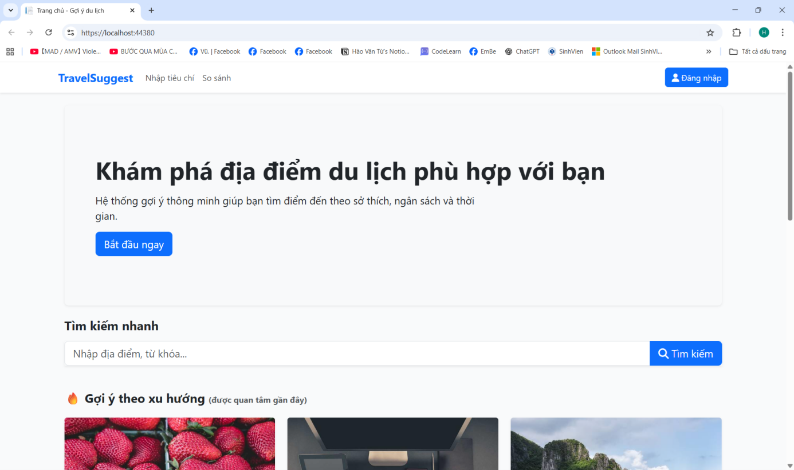 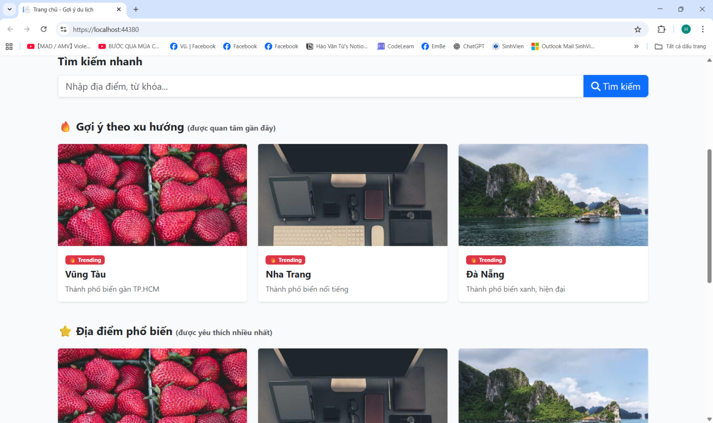 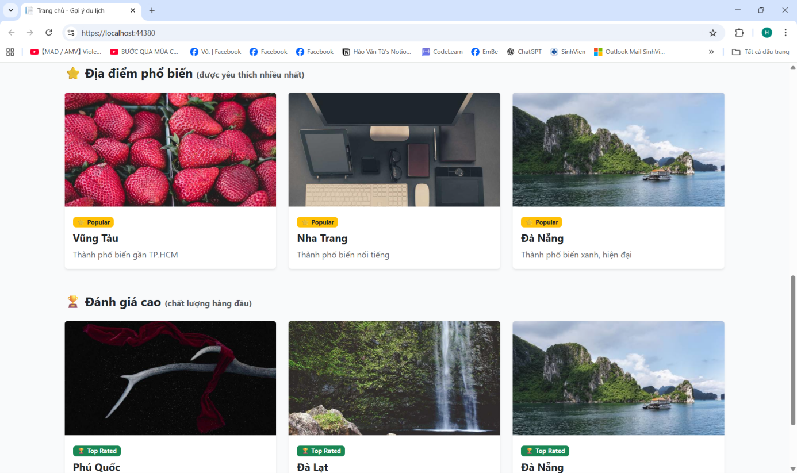
    <br><br>
    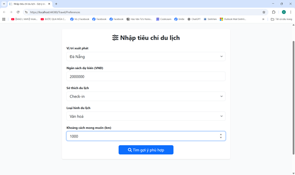 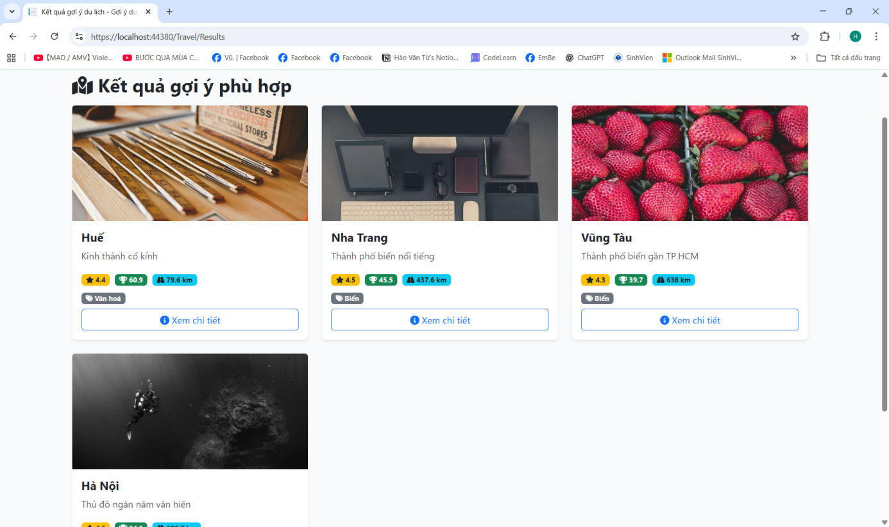
     <br><i>Trang chủ và tìm kiếm</i>
  </p>
</details>

<details>
  <summary><b>Chi tiết & So sánh địa điểm (3 ảnh)</b></summary>
  <br>
  <p align="center">
    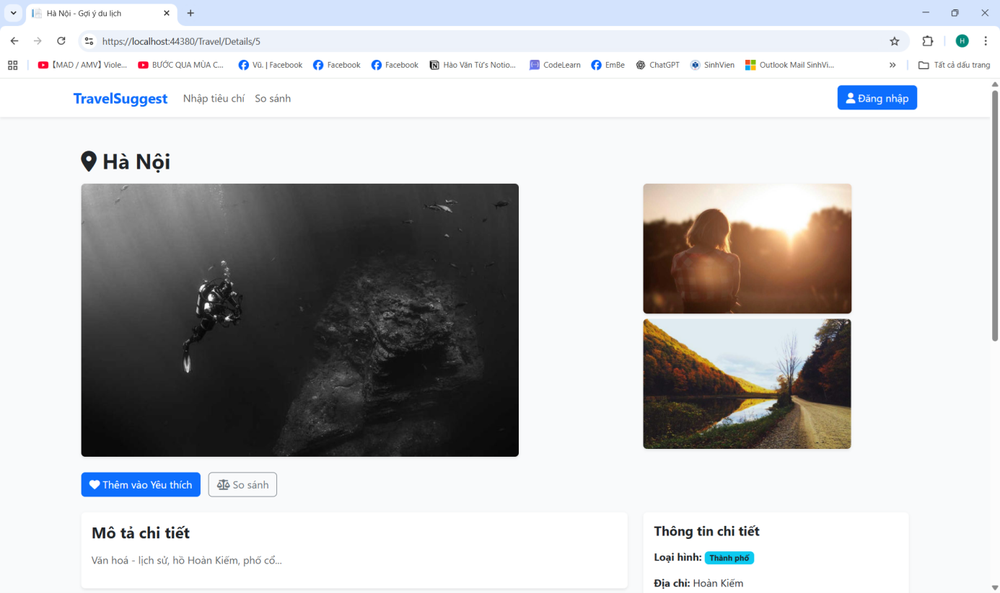 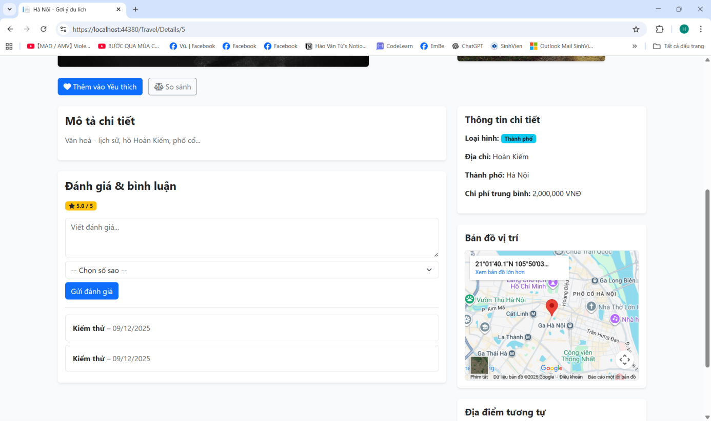
    <br><br>
    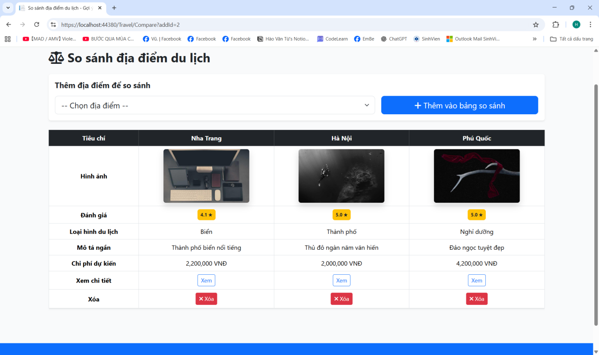
    <br><i>Hệ thống so sánh các tiêu chí du lịch thông minh và xem chi tiết địa điểm</i>
  </p>
</details>

<details>
  <summary><b>Lập kế hoạch & Trang cá nhân (4 ảnh)</b></summary>
  <br>
  <p align="center">
    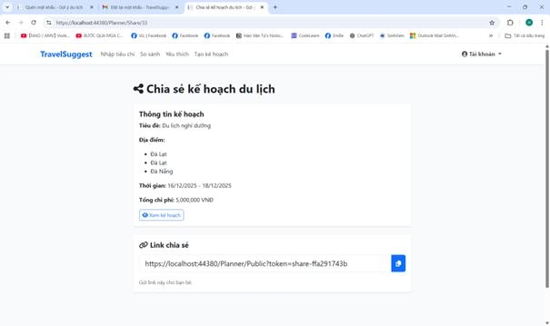
    <br><br>
    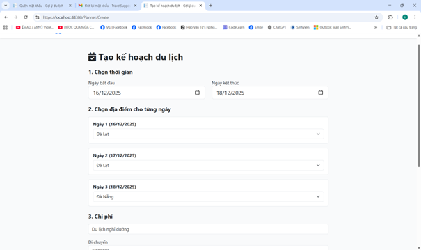 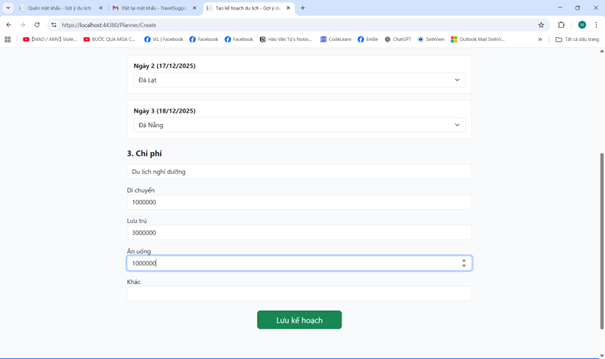 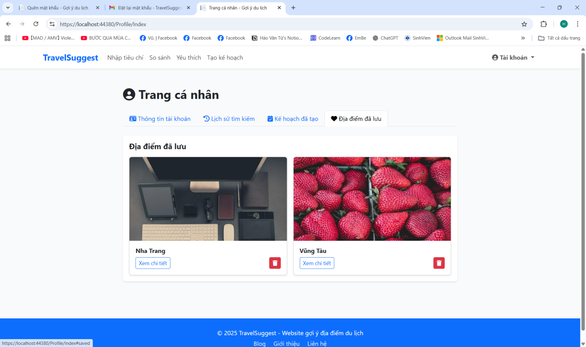
    <br><i>Quản lý lịch trình cá nhân và lưu trữ địa điểm yêu thích</i>
  </p>
</details>

### 🛠️ 2. Hệ thống Quản trị (Admin)
<details>
  <summary><b>Quản lý nghiệp vụ (1 ảnh)</b></summary>
  <br>
  <p align="center">
    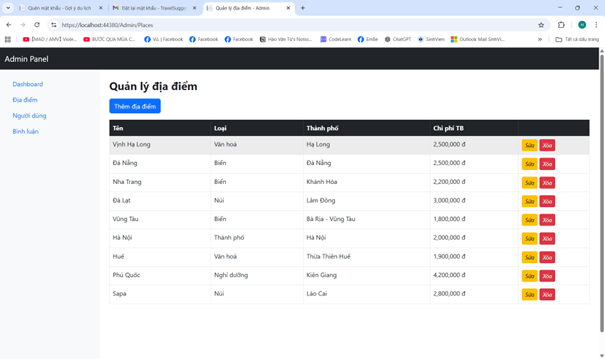
    <br><i>Giao diện CRUD địa điểm dành cho Quản trị viên</i>
  </p>
</details>

---

## 💡 Điểm Nhấn Kỹ Thuật (Technical Highlights)

Trong dự án này, mình đã tập trung giải quyết các bài toán kỹ thuật sau:
1. **Thiết kế Database tối ưu:** Xây dựng mô hình quan hệ (RDBMS) chặt chẽ để quản lý đa dạng thực thể (User, Place, Plan, Review).
2. **Xử lý Logic Phức tạp:** Hiện thực hóa tính năng **So sánh địa điểm** và **Lập kế hoạch du lịch**, yêu cầu kỹ năng truy vấn dữ liệu nâng cao và xử lý mảng/đối tượng trong C#.
3. **Phân quyền người dùng (Authorization):** Tách biệt hoàn toàn luồng giao diện và quyền hạn giữa người dùng thông thường và Quản trị viên (Admin).
4. **Giao diện Responsive:** Sử dụng Bootstrap giúp website hiển thị tốt trên nhiều kích thước màn hình khác nhau.

---

## 💻 Cài Đặt

1. **Clone repository:**
   ```bash
   git clone https://github.com/tuhaovan917-ship-it/Nhom04_CNPM_WebsiteGoiYDiaDiemDuLich.git
